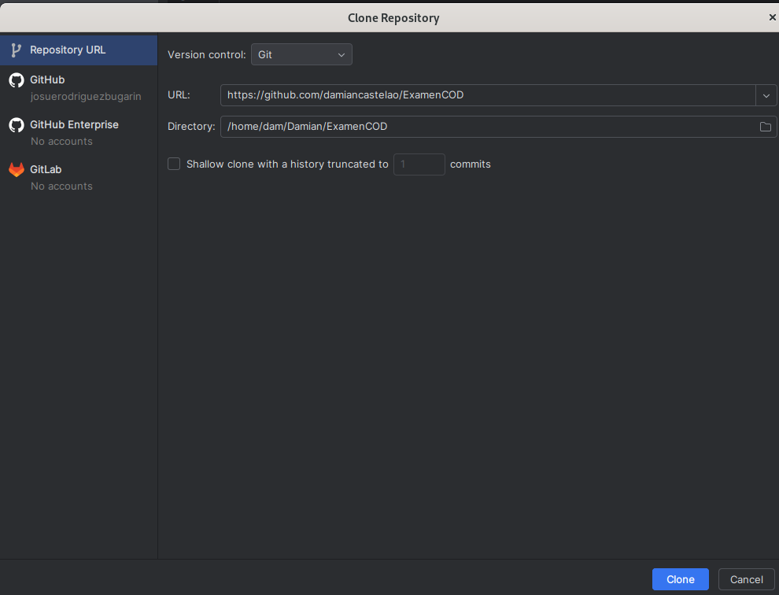
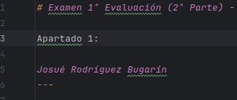
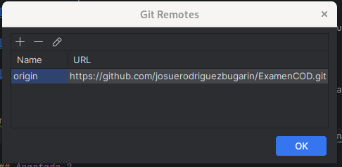
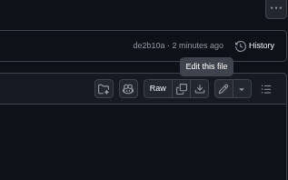
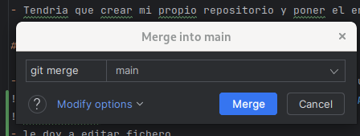
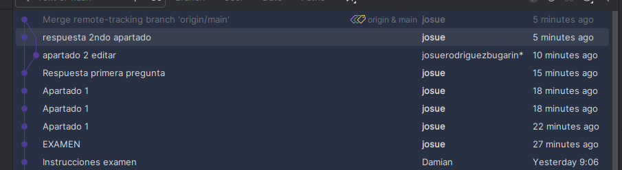
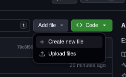
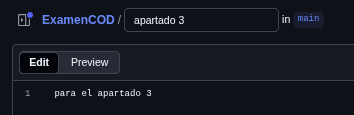
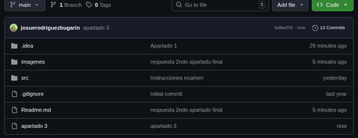
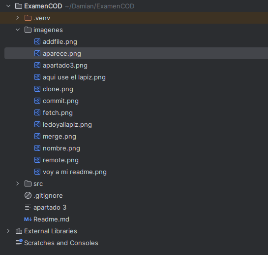

# Examen 1ª Evaluación (2ª Parte) - Control de Versiones

Apartado 1: (Aqui use el lapiz)

Josué Rodríguez Bugarín
---

## Instrucciones
- Los commits de cada apartado deben tener el mensaje *"Apartado X - descripción del cambio realizado"*
- Entrega en la tarea de Moodle tu repositorio
- Solo se corrigen los commits que estén en el repositorio remoto

### Apartado 1

- Clona este repositorio.

- Modifica este Readme, poniendo tu nombre completo, realiza un `commit` con el mensaje *"Apartado 1"* y un `push`.

- Aqui pongo mi nombre en el read.me

- y hago un commit que pone "Apartado 1" y push para subirlo a github.

Pregunta 
- ¿Qué paso es fundamental cuando clonamos un repositorio ajeno para que podamos subir nuestros propios commits? Explícalo y utiliza capturas de pantalla.

- Tendria que crear mi propio repositorio y poner el enlace del repositorio que eh creado para asi ponerlo en mi pycharm y subir mis propios commits

### Apartado 2

- Realiza una modificación en el código en la web de tu repositorio en GitHub
 Primero voy a mi read.me para editarlo.
 
- le doy a editar fichero.
 
- y le hago un breve cambio y le doy a commit changes y le pongo de titulo al commit "Apartado 2 edit"
- Utiliza fetch para descargar los cambios realizados en tu repositorio.
- Respuesta: para el fetch me voy en pycharm a git > fetch y despues usar merge

Pregunta
- Explica los pasos para que el código modificado en GitHub, llegue a tu rama principal local. Explícalo con capturas de pantalla.

# Respuesta

Al hacer cambios en github en el read.me estoy haciendo un commit y para que los cambios se me apliquen en pycharm tengo que usar el fetch y el merge para que se me apliquen.

### Apartado 3

- Realiza otro cambio desde la web de tu repositorio en GitHub.
- Utiliza pull para descargar los cambios realizados en tu repositorio.

Pregunta
- Explica los pasos dados para que el cambio realizado en GitHub, llegue a tu rama principal local. Explícalo con capturas de pantalla.

- en github añado un nuevo fichero que le llamara "apartado 3"

- y ahora tengo que hacer el pull y despues del pull hacer un fetch y merge y se aplicaran los cambios

- y me aparecen los cambios que hice en github en pycharm.